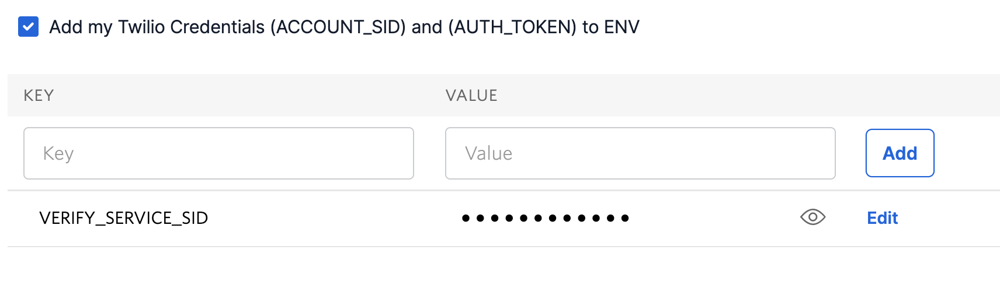
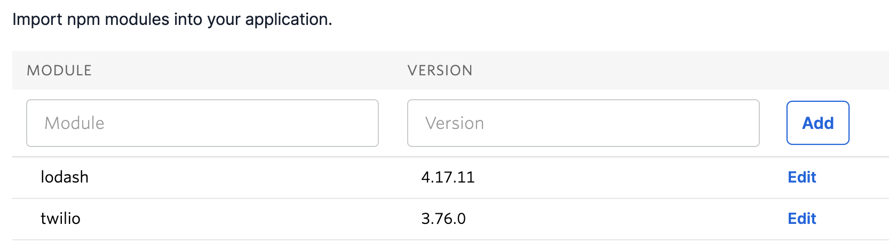
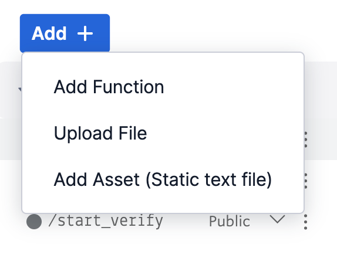
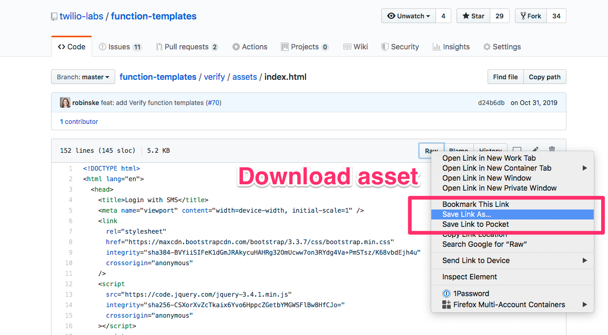

# How to use Function Templates

There are three ways you can use the templates found in this project:

1. [With the Twilio CLI](#twilio-cli)
2. [In the Twilio Console using the Functions UI](#functions-ui)
3. [In your existing Node.js application](#nodejs)

<h2 id="twilio-cli">Using Function Templates with the Twilio CLI</h2>

> If you don't have the Twilio CLI installed, start by [installing the Twilio CLI](https://www.twilio.com/docs/twilio-cli/quickstart)

### Step 0: Make sure you have the Serverless Toolkit installed:

```bash
twilio plugins:install @twilio-labs/plugin-serverless
```

### Step 1: Pick your template

You can pick your preferred template by either visiting the [`function-templates` repository on GitHub](https://github.com/twilio-labs/function-templates) or by running the following command:

```bash
twilio serverless:list-templates
```

Remember the ID for your template. On GitHub that's the name of the directory you picked and in the CLI that's the part in the paranthesis. For example: `verify`

### Step 2: Create a project with your chosen template

To create a new project with the name `example` and the template `verify` run the following command:

```bash
twilio serverless:init example --template=verify
```

This will create a new directory called `example` (or whatever name you picked) and will download all necessary files and dependencies for you.

### Step 3: Navigate into your project and start the local server

```bash
cd example
twilio serverless:start
```

This command will start a local development server so you can explore the code and functionality.

### Step 4: Check your template's README

Depending on the template there might be additional setup instructions necessary to make the project work. Check the instructions by going to github.com/twilio-labs/function-templates and opening the directory of your template.

### Step 5: Deploy your code

You can deploy the code you wrote by running the following command:

```bash
twilio serverless:deploy
```

> **Please Note**: Any values stored in the `.env` file will be automatically set for your deployment and any `dependencies` inside your `package.json` will be installed for your deployment.

<h2 id="functions-ui">Using Function Templates in the Twilio Console</h2>

You'll have the best experience of using any of these templates with the Twilio CLI.

If for some reason you are constraint to not using the Twilio CLI, you can use the [web UI in the Twilio Console](https://console.twilio.com/us1/develop/functions/services?frameUrl=%2Fconsole%2Ffunctions%2Foverview%2Fservices). It will require some manual work. This guide will help you walk through it.

### Step 1: Pick your template

You can find a list of templates by visiting the [`function-templates` GitHub repository](https://github.com/twilio-labs/function-templates). Most of the top level directories except `docs`, `test` or anything prefixed with `_` or `.` are templates. You can also find a full list with descriptions in the [`templates.md` file](./templates.md).

Open the respective template directory for your template. For example [`verify/`](verify/).

### Step 2: Create a service

Create a new [Functions service from the console](https://console.twilio.com/us1/develop/functions/services?frameUrl=%2Fconsole%2Ffunctions%2Foverview%2Fservices).

### Step 2: Configure your environment variables

Environment variables are configuration values that often contain information such as API tokens or values such as phone numbers. Every template might need different environment variables. The ones required by your template can be found in the `.env` file.

Click on `Environment Variables` in the _Settings_ section of your Functions service and create under _Environment Variables_ a key/value pair for each entry in the `.env` file.

For example if the `.env` file looks like this:

```bash
# Your Twilio phone number
VERIFY_SERVICE_SID=
```

You'll want to create a new environment variable with the key `VERIFY_SERVICE_SID` and the value of a [Verify Service SID](https://www.twilio.com/console/verify/settings).



> If you find a template that uses `ACCOUNT_SID` and `AUTH_TOKEN` make sure to check the "Add my Twilio checkbox at the top of the Configuration section.

### Step 3: Install dependencies

Some templates require additional dependencies. You can find the list of required dependencies inside the `package.json` of the respective template directory under the `dependencies` object.

For example if the `package.json` looks like this:

```json
{
  "name": "stripe-sms-receipt",
  "dependencies": {
    "stripe": "^8.20.0"
  }
}
```

You'll want to create a dependency entry with the name `stripe` and the version `^8.20.0`.



### Step 4: Create Functions

A template might have multiple Functions. You'll have to create a new Function for each JavaScript file that you'll find inside the `functions/` directory of a template.

For example the [`verify` template](https://github.com/twilio-labs/function-templates/tree/master/verify/functions) has two JavaScript files in the `functions/` directory.

The name of the Function gives away two pieces of information:

1. If the name contains `.protected.` you'll want to make sure that the checkbox of _Check for valid Twilio signature_ is checked when you create the Function.
1. Anything before the `.` is the path of the Function. For example for the `verify` template those are two Function paths we want: `/check-verify` and `/start-verify`. **Note**: Some Functions might be in nested directories. The Console UI doesn't support nested paths, so you'll have to pick a different path and update all references in the code.

Head over to the Functions service you created. For each Function in the template:

1. Create a new Function (click Add + and selecte "Add Function")
1. Specify the path of the Function based on the filename
1. Copy the code from the JavaScript file
1. Functions are _protected_ by default. Change this to _public_ if you need to access the function from an application outside of Twilio
1. Click _Save_



Repeat for each necessary Function.

**Click _Deploy All_ to deploy saved Functions**

### [Optional] Step 5: Download assets

Some templates might contain an `assets` folder. In that case you'll have to upload those assets. But before you can upload them, you'll have to download them to your computer. You can do this by opening each asset in your template and right click on the `Raw` button and click on _Save As_. Store the file somewhere on your computer.



### [Optional] Step 6: Upload assets to Twilio Runtime

After you've downloaded all required assets, upload all files that you downloaded using the same method of creating a new function, but select "Add Asset (Static text file)" instead. If a file contains `.private.` in the original filename, set the visibility to `private`.

## Using Function Templates without hosting it on Twilio

<h2 id="nodejs">In your existing Node.js application</h2>

The templates in this project are designed to work with Twilio Functions. However, the majority of the code is Node.js code that is not Twilio Functions specific. If you want to use the code in your existing Node.js application, here are a few things to consider:

1. You'll need to have a Node.js server that can receive HTTP GET and POST requests. One option would be [Express](https://expressjs.com). You can also use any other Serverless hosting environment.
2. Any Node.js dependencies that will are necessary for the respective template can are in the `dependencies` field of the respective `package.json` of the template. You might also require to install the [`twilio` Node.js library](https://npm.im/twilio).
3. Some templates require to have environment variables set to function. You can find the necessary environment variables in the `.env` file of the respective template directory.
4. You can find the JavaScript code in two areas. Anything in the `functions/` directory of a template directory represents an endpoint (see next point). Any JavaScript files or other static files are in the `assets/` directory.
5. A Twilio Function has a particular format. The `context` is where environment variables are being passed in, `event` will represent any query parameters or POST body properties passed to the request. Any access to `context` or `event` might mean that you have to replicate those in your endpoint.
   ```js
   exports.handler = function(context, event, callback) {...}
   ```
6. Anything that contains `.protected.` in the filename should be access protected by [verifying the Twilio signature](https://www.twilio.com/docs/usage/webhooks/webhooks-security). Anything with `.private.` in the filename should not be publicly accessible.
