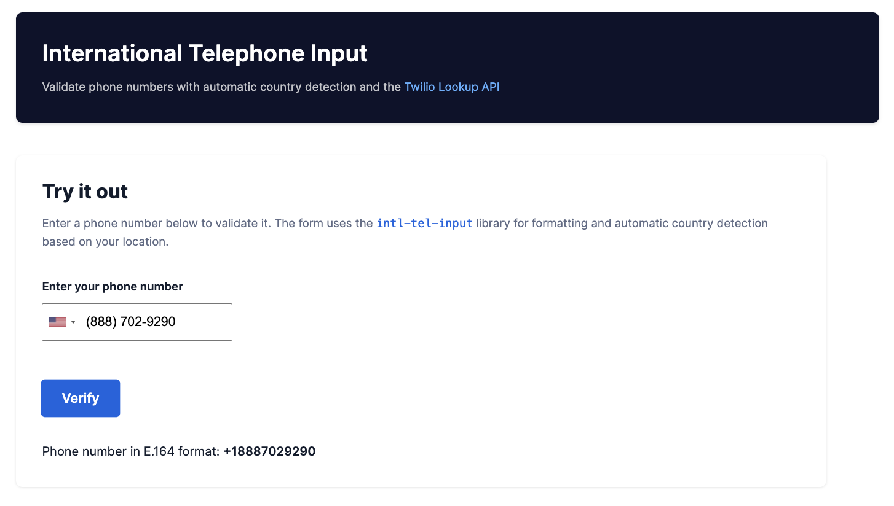

# International Telephone Input Validation with Twilio Lookup

Validate international phone numbers with automatic country detection and Twilio's Lookup API v2



## Overview

This template provides a production-ready international phone number input form with:
- **Automatic formatting** using the intl-tel-input library (v23.1.0)
- **Country detection** based on user's geographic location
- **Client-side validation** with real-time format checking
- **Server-side verification** via Twilio Lookup API v2
- **E.164 format conversion** for global compatibility

For production phone number collection, we strongly recommend adding [phone verification](https://github.com/twilio-labs/function-templates/tree/main/verify) to confirm users have control of the number.

## Related Resources

- [Phone Verification Template](https://github.com/twilio-labs/function-templates/tree/main/verify) - Recommended for production phone number collection
- [International Phone Number Input Blog Post](https://www.twilio.com/blog/international-phone-number-input-html-javascript) - Tutorial and best practices
- [intl-tel-input Library Documentation](https://github.com/jackocnr/intl-tel-input) - Complete library reference
- [Twilio Lookup API v2 Documentation](https://www.twilio.com/docs/lookup/v2-api) - API reference and capabilities


## How It Works

This template uses a simple, lightweight HTML/JavaScript implementation for zero-build-step deployment. All code is static and runs directly in the browser, maintaining full compatibility with Twilio Functions Quick Deploy.

When a user submits a phone number:
1. intl-tel-input formats the number to E.164 standard
2. The frontend sends a POST request to `/lookup` endpoint
3. The backend function calls Twilio Lookup API v2
4. The result is returned and displayed to the user

## How to use the template

The best way to use the Function templates is through the Twilio CLI as described below. If you'd like to use the template without the Twilio CLI, [check out our usage docs](../docs/USING_FUNCTIONS.md).

### Environment variables

This project requires some environment variables to be set. To keep your tokens and secrets secure, make sure to not commit the `.env` file in git. When setting up the project with `twilio serverless:init ...` the Twilio CLI will create a `.gitignore` file that excludes `.env` from the version history.

In your `.env` file, set the following values:

| Variable             | Meaning                                                           | Required |
| :------------------- | :---------------------------------------------------------------- | :------- |
| `ACCOUNT_SID`        | Find in the [console](https://www.twilio.com/console)             | Yes      |
| `AUTH_TOKEN`         | Find in the [console](https://www.twilio.com/console)             | Yes      |

### Function Parameters

`lookup.js` expects the following parameters:

| Parameter      | Description                                 | Required |
| :------------- | :------------------------------------------ | :------- |
| `phone`        | Phone number in [E.164 format](https://www.twilio.com/docs/glossary/what-e164) | Yes |


## Create a new project with the template

1. Install the [Twilio CLI](https://www.twilio.com/docs/twilio-cli/quickstart#install-twilio-cli)
2. Install the [serverless toolkit](https://www.twilio.com/docs/labs/serverless-toolkit/getting-started)

```shell
twilio plugins:install @twilio-labs/plugin-serverless
```

3. Initiate a new project

```
twilio serverless:init phone-input-sample --template=international-telephone-input && cd phone-input-sample
```

4. Add your environment variables to `.env`:

Make sure variables are populated in your `.env` file. See [Environment variables](#environment-variables).

5. Start the server :

```
npm start
```

5. Open the web page at https://localhost:3000/index.html and enter your phone number to test

ℹ️ Check the developer console and terminal for any errors, make sure you've set your environment variables.

## Deploying

Deploy your functions and assets with either of the following commands. Note: you must run these commands from inside your project folder. [More details in the docs.](https://www.twilio.com/docs/labs/serverless-toolkit)

With the [Twilio CLI](https://www.twilio.com/docs/twilio-cli/quickstart):

```
twilio serverless:deploy
```
