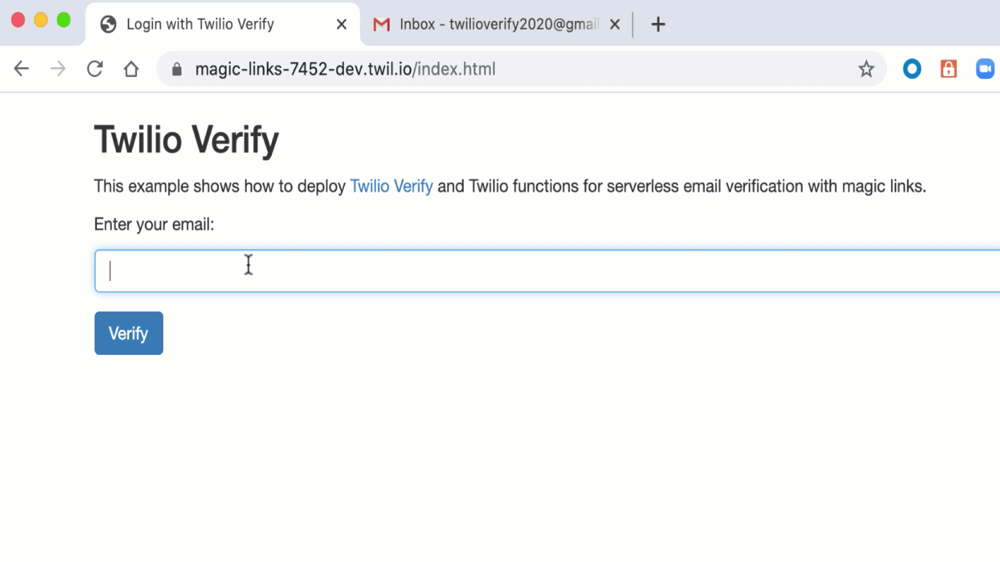

# "Magic Link" Email Verification

These function show you how to send one-click email verification using [Twilio Verify](https://www.twilio.com/docs/verify/api).



## How to use the template

The best way to use the Function templates is through the Twilio CLI as described below. If you'd like to use the template without the Twilio CLI, [check out our usage docs](../docs/USING_FUNCTIONS.md).

## Pre-requisites

[Follow steps 1-6 in the documentation](https://www.twilio.com/docs/verify/email) to link your SendGrid account to your Twilio Verify Service.

**Important - for Step #4 [use this file as a template.](./assets/email-template.html)**

All steps are described in detail in the [documentation.](https://www.twilio.com/docs/verify/email)

### Environment variables

This project requires some environment variables to be set. To keep your tokens and secrets secure, make sure to not commit the `.env` file in git. When setting up the project with `twilio serverless:init ...` the Twilio CLI will create a `.gitignore` file that excludes `.env` from the version history.

In your `.env` file, set the following values:

| Variable             | Meaning                                                            | Required |
| :------------------- | :----------------------------------------------------------------- | :------- |
| `ACCOUNT_SID`        | Find in the [console](https://www.twilio.com/console)              | Yes      |
| `AUTH_TOKEN`         | Find in the [console](https://www.twilio.com/console)              | Yes      |
| `VERIFY_SERVICE_SID` | Create one [here](https://www.twilio.com/console/verify/services)  | Yes      |
| `CALLBACK_URL`       | Use `http://localhost:3000/verify.html` for testing                | Yes      |

### Function Parameters

`start-verify.js` expects the following parameters:

| Parameter      | Description  | Required |
| :------------- | :------------| :------- |
| `to`           | Email        | Yes      |

`check-verify.js` expects the following parameters:

| Parameter           | Description                           | Required |
| :------------------ | :------------------------------------ | :------- |
| `to`                | Email                                 | Yes      |
| `verification_code` | Populated by SendGrid email template  | Yes      |

## Create a new project with the template

1. Install the [Twilio CLI](https://www.twilio.com/docs/twilio-cli/quickstart#install-twilio-cli)
2. Install the [serverless toolkit](https://www.twilio.com/docs/labs/serverless-toolkit/getting-started)

```shell
twilio plugins:install @twilio-labs/plugin-serverless
```

3. Initiate a new project

```
twilio serverless:init magic-links --template=magic-links && cd magic-links
```

4. Add your environment variables to `.env`:

Make sure variables are populated in your `.env` file. See [Environment variables](#environment-variables).

5. Start the server :

```
npm start
```

5. Open the web page at https://localhost:3000/index.html and enter your email to test

ℹ️ Check the developer console and terminal for any errors, make sure you've set your environment variables.

## Deploying

Deploy your functions and assets with the following command. Note: you must run these commands from inside your project folder. [More details in the docs.](https://www.twilio.com/docs/labs/serverless-toolkit)

With the [Twilio CLI](https://www.twilio.com/docs/twilio-cli/quickstart):

```
twilio serverless:deploy
```