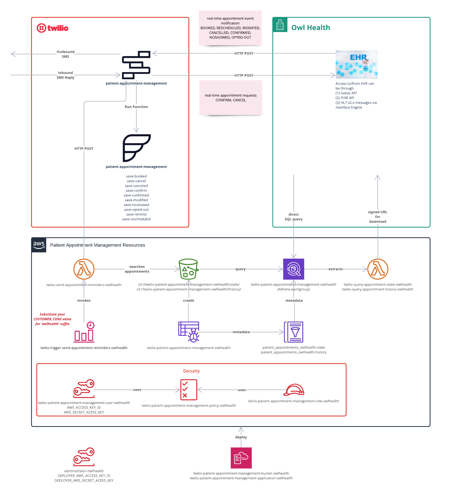
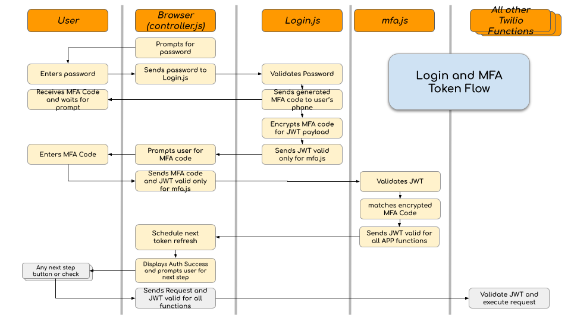
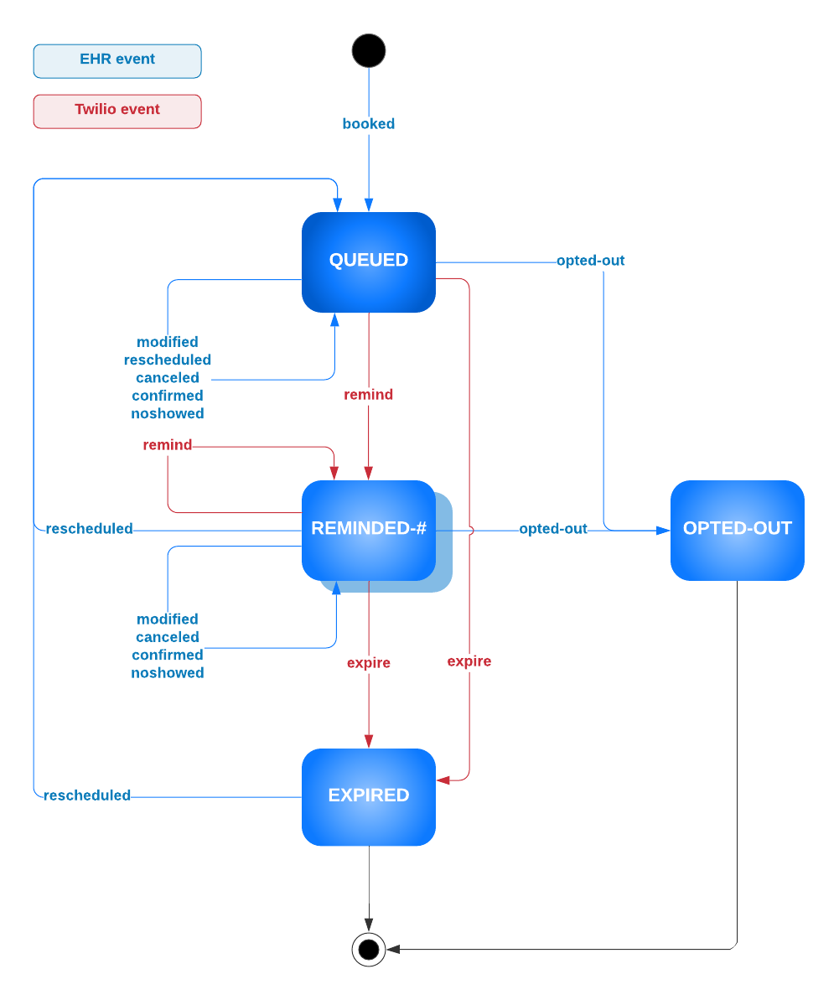

# Appointment Management with EHR Integration App: Technical Guide

*This document is intended to serve as a technical guide for customers who are interested in the architecture of the Appointment Management with EHR Integration application, and for understanding installation and customization possibilities.*

*Installation of this application is supported using the latest versions of Chrome and Firefox. Installation via Internet Explorer has not been officially tested and although issues are not expected, unforeseen problems may occur.*

## Application Overview

***

***

The Appointment Management with EHR Integration app packages together the core components of a deployable prototype for basic, two-way SMS communication between patient and provider using appointment information that is shared between the application and an integrated [Electronic Health Record (EHR)](https://www.healthit.gov/faq/what-electronic-health-record-ehr). This app is intended to support healthcare providers who are interested in building their own appointment management solution to understand what is possible using Twilio, and to accelerate the path to success by providing core building blocks and necessary workflows for implementing SMS appointment communication such as scheduling confirmations, reminders and cancelations.

The application includes the necessary Twilio components and an appointment reminder scheduling service, all pre-configured for deployment of a working prototype, ready to integrate directly with an EHR for demonstration of the possibilities (the separate step of EHR integration is required for the app to work). This application is not intended to be a production-ready app, but rather will allow you to install a functioning prototype into your test environment, establish a working EHR integration, and to explore how different Twilio components and functions can be leveraged to meet your needs.

Specifically, the Appointment Management with EHR Integration application implements the following capabilities:

- (*Outbound*) SMS notifications sent to patients based on appointment events occurring in the EHR:
  - booking/scheduling
  - rescheduling (date/time changes)
  - modification (location and/or provider)
  - confirmation
  - cancellation
  - noshows

- (*Inbound*) SMS response sent from patient "to the provider" (technically, to the EHR)
  - confirmation request
  - cancellation request

- (*Outbound*) SMS reminders sent to patient based on scheduled appointments (up to 2 reminders per patient per day)

*(For more details on appointment events supported by this application
, please reference the [EHR Integration Guide](https://twilio-cms-prod.s3.amazonaws.com/documents/EHR_Appointment_Management_App_EHR_Integration_Guide.pdf))*

## Architecture Highlights

***

***

This section provides a high-level overview of the application's architecture, including a discussion of the baked-in application components, the EHR integration that is necessary for the app to function, and an  Architecture diagram.



### Application Components

***

The application's architecture consists of 3 main components that interact closely together: Twilio Studio Flow, Twilio Functions and AWS resources.
- **Twilio Studio Flow** implements the SMS interaction with the patient (i.e. customizable message text and workflow) by taking configured parameters (from both the EHR messages and from your preferred message details configured in the Flow itself) and sending appropriate messages.
- **Twilio Functions** collect appointment events from the EHR and store them in AWS S3 (for appointment reminders).
- **Amazon Web Services (AWS) Resources** are used to build a persistent data layer which drives the appointment reminder messages. The AWS layer serves as the source of truth for scheduling notifications that are not triggered by real-time events from the EHR, and to queue the appointment information for initiating scheduled reminders. The AWS layer consists of:
  - an **S3** bucket for storing up-to-date appointment information
  - a **Lambda** function to identify triggering events and communicate with Studio Flow, and
  - a **scheduler** to trigger the appropriately timed appointment reminders

*(Although the baked-in architecture leverages AWS offerings for the persistent data layer, the application can be modified to use other cloud services providers, such as Microsoft Azure and GCP (Google Cloud Platform), that offer similar capabilities)*

### EHR Integration

***

This application is intended to sit next to your EHR, and will rely on a near real-time EHR integration interface coupled with the application's components, in order to function.  As long as your EHR integration interface can facilitate the real-time data exchange with the EHR, the app can integrate with a variety of integration methods including HL7 v2 messaging, FHIR, native EHR APIs, or available third-party integration APIs. Once scheduling messages are received by Twilio from your EHR, they are converted into JSON to complete the information flow through Twilio and AWS.

## Installation Information

***

***

This section details the requirements for a successful deployment and installation of the prototype application, including the necessary prerequisite steps, the variables that are needed to initiate installation, and the installation steps themselves.

### Prerequisites

***

The following prerequisites must be satisfied prior to installing this application.

#### Provision Twilio Assets
You will need the following Twilio assets ready prior to installation:
- **Twilio account**
  - Create a Twilio account by signing up [here](https://www.twilio.com/try-twilio).
  - *(You will use your login information to get started with the Quick Deploy installation on the app's CodeExchange page)*
- **Twilio phone number** 
  - After provisioning your Twilio account, you will need to [purchase a phone number](https://www.twilio.com/console/phone-numbers/incoming) to use in the application.
  - Make sure the phone number is SMS enabled
  - *(This will be the number patients receive texts from)*

#### Prepare AWS Assets
You will need the following AWS assets ready prior to installation:
- **AWS Account**
  - Create a dedicated AWS account for this application deployment
    (https://aws.amazon.com/resources/create-account/).
    - As admin-level privilege will be required to create various AWS resources (including IAM role/user/policy), we **strongly** recommend that you create a dedicated AWS account separate from other AWS accounts that your organization owns.
    - You may place the new AWS account within your [AWS Organizations](https://docs.aws.amazon.com/organizations/latest/userguide/orgs_introduction.html) for consolidated billing, if desired (not required).

- **Create AWS deployer user and role 
  - In order to deploy the application's AWS components, you will need a deployer user and a role.
  - Use this [link](https://us-west-2.console.aws.amazon.com) to create your AWS deployer user and role through CloudFormation Quick Create
    -Note: this runs a CloudFormation template file to create the CloudFormation stack that creates the deployer user and role. If desired, you can inspect this file [here](https://twilio-cms-prod.s3.amazonaws.com/documents/cloudformation-stack-deployer.yml).
    -Select “I acknowledge that AWS CloudFormation might create IAM resources with custom names” and then select “Create Stack”
    -Once the stack is created successfully, you will be taken to the CloudFormation console page that shows the newly created ‘twilio-patient-appointment-managment-deployer’ stack.
### Environment Variables

### PAM V2 - Suggested ReadMe updates
   - Note: This [link](https://us-west-2.console.aws.amazon.com/cloudformation/home?region=us-west-2#/stacks/) can be used to check whether the deployer user and role have been created successfully. 
- Take note of AWS Deployer Key ID and Access Key
  - Once the deployer user and role have been created, a key ID and Access Key will be available, which are required for app deployment from the Twilio Code Exchange page.
  - Select this [link](https://us-west-2.console.aws.amazon.com/secretsmanager/home?region=us-west-2#!/secret?name=twilio%2Fpatient-appointment-management%2Fdeployer) to be navigated to your Secrets Manager
  - Scroll down to the “Secret Value” section and select “Retrieve Secret Value”
  - Take note of the Key ID and Access Key. These variables will be required for application deployment


***

The following environment variables are required for proper deployment of this application (you will input necessary environment variables in the app's initial CodeExchange page prior to deployment). After the application is deployed, you can find these environment variables in your `.env` file:

| Variable | Description | Required |
| :------- | :---------- | :------- |
|`CUSTOMER_NAME` |The organization name which can be configured to appear in the SMS to the patient|Yes|
|`CUSTOMER_CODE` |The organization short name, which will be suffixed to AWS resources|Yes|
|`REMINDER_OUTREACH_START` |The start time of the outreach window in which SMS can be sent to patients for appointment reminders (the outreach window can be used, for example, to ensure SMS are not sent to patients at unreasonable times of day): *configure as HHMM; this variable is inclusive; default is 0000 (i.e. midnight); the app will honor the patient’s local timezone*|Yes|
|`REMINDER_OUTREACH_FINISH` |The end time of the outreach window in which SMS can be sent to patients for appointment reminders: *configure as HHMM; this variable is exclusive; the app will honor the patient’s local timezone*|Yes|
|`REMINDER_FIRST_TIMING` |The hours/minutes prior to appointment time in which the first reminder should be sent to the patient: *configure as HHMM; default is 4800*|Yes|
|`REMINDER_SECOND_TIMING` |The hours/minutes prior to appointment time in which the second reminder should be sent to the patient: *configure as HHMM; default is 2400; second reminder can be turned off by setting this variable to 0000*|Yes|
|`TWILIO_PHONE_NUMBER` |The Twilio phone number you want to use for sending and receiving SMS through the app|Yes|
|`APPLICATION_PASSWORD` |The Password used to restrict access to sensitive data (this password will be required to access and manipulate the application after deployment)|Yes|
|`SALT` |Change this to invalidate existing auth tokens|No|
|`DEPLOYER_AWS_ACCESS_KEY_ID` |The `AWS_ACCESS_KEY_ID` of the IAM user you provisioned for deploying this application|Yes|
|`DEPLOYER_AWS_SECRET_ACCESS_KEY`|The `AWS_SECRET_ACCESSS_KEY` of the IAM user you provisioned for deploying this application|Yes|
|`AWS_REGION` |The `AWS_REGION` where your AWS resources will be deployed (we **strongly** recommend not changing this from the default, due to slight differences between AWS regions)|Yes|
|`ADMINISTRATOR_PHONE_NUMBER` |The phone number where you will receive six digit multi-factor authentication (MFA) code after logging in with your password. This needs to be entered as the next step to fully authenticate. |Yes|

To keep your tokens and secrets secure, make sure to not commit the `.env` file in git. When setting up the project with
```shell
twilio serverless:init
```
the Twilio CLI will create a `.gitignore` file that excludes `.env` from the version history.

## Architecture Details

***

***

This section takes a deeper dive into the application's architecture by outlining the specific assets that are included in the app, what each of the application's components do, the functions and resources that are leveraged, as well as describing how events and dispositions are used to maintain appropriate appointment states within the system.

### Application Components

***

Below is a description of each of the components that you will find baked into the application (including Twilio and AWS components).

#### Twilio Studio Flow

This application includes a preconfigured Twilio Studio Flow, which implements:

- SMS interaction (outbound & inbound) with the patient per appointment event occurrence
- Saving appointment event information to AWS S3 bucket by calling Twilio functions
- Communicating to your EHR endpoint for 2-way (inbound to EHR) appointment requests (such as appointment cancelation & appointment confirmation requests)

*For more information on how the Studio Flow component works, check out [Twilio Studio Documentation](https://www.twilio.com/docs/studio).*

#### Twilio Service (Assets & Functions)
The application leverages service assets and functions
, which are part of Twilio Runtime.
Check out [Twilio Runtime Documentation](https://www.twilio.com/docs/runtime)
for additional information.

#### Assets
Static assets (files) of the application:

| Asset (under `/assets`) | Description |
| :-----------------------| :---------- |
|`/architecture.png` |Technical architecture diagram|
|`/controller.js` |Javascript functions that control application behavior from `index.html`|
|`/index.html` |Main application page for application user|
|`/state-transition.png` |Disposition/state transition diagram|
|`/studio-flow-template.json` |Deployable Studio Flow template|
|`/style.css` |Stylesheet used in `index.html`|
|`/token-flow.png` |MFA-based token flow diagram|
|`/aws/cloudformation-stack-application.yml`|AWS CloudFormation template for applications resources|
|`/aws/cloudformation-stack-bucket.yml` |AWS CloudFormation template for S3 bucket|
|`/aws/query_appointment_history.js` |Lambda function code for querying appointment event history stored in S3|
|`/aws/query_appointment_state.js` |Lambda function code for querying appointment event state (snapshot) stored in S3|
|`/aws/send_appointment_reminders.js` |Lambda function code for sending appointment reminders per 4 reminder configuration parameters|

#### Functions
Functions used in the application:

| Functions (under `/functions`) | Description |
| :----------------------------- | :---------- |
|`/auth.js` |Checks authorization|
|`/get-datetime-parts.js` |Returns multiple datetime parts from ISO8601 string|
|`/helpers.js` |Shared functions used by other functions|
|`/login.js` |Handles login from `index.html` page|
|`/mfa.js` |Handles MFA logic from `index.html` page|
|`/refresh-token.js` | Provides updated token periodically to `index.html` page|
|`/save-booked.js` |Saved booked appointment notification event to S3 bucket|
|`/save-cancel.js` |Saves cancel appointment request event to S3 bucket|
|`/save-canceled.js` |Saves canceled appointment notification event to S3 bucket|
|`/save-confirm.js` |Saves confirm appointment request event to S3 bucket|
|`/save-confirmed.js` |Saves confirmed appointment notification event to S3 bucket|
|`/save-modified.js` |Saves modified appointment notification event to S3 bucket|
|`/save-noshowed.js` |Saves noshowed appointment notification event to S3 bucket|
|`/save-opted-out.js` |Saves opted-out appointment notification event to S3 bucket|
|`/save-remind.js` |Saves appointment reminder event to S3 bucket|
|`/save-rescheduled.js` |Saves rescheduled appointment notification event to S3 bucket|
|`deployment/check.js` |Validates environment variables|
|`deployment/check-aws-application.js` |Checks deployment state of AWS application|
|`deployment/check-aws-bucket.js` |Checks deployment state of AWS bucket|
|`deployment/check-query.js` |Checks execute state of appointment data query|
|`deployment/check-studio-flow.js` |Checks deployment state of Twilio Studio Flow|
|`deployment/deploy-aws-application.js`|Deploys AWS application|
|`deployment/deploy-aws-bucket.js` |Deploys AWS bucket|
|`deployment/deploy-aws-code.js` |Deploys AWS Lambda code|
|`deployment/deploy-studio-flow.js` |Deploys Twilio Studio Flow|
|`deployment/execute-query.js` |Executes appointment data query|
|`deployment/simulation-parameters.js` |Gets customer parameters for display in simulation page |
|`deployment/simulation-event.js` | Simulates events in the simulation page |
|`deployment/test-deployment.js` |Executes tests post deployment (excludes inbound communication to EHR)|

#### AWS Resources
AWS Resources used in the application:

| Resource Type | Resource Name | Description |
| :------------ | :------------ | :---------- |
|`AWS::S3::Bucket` |twilio-patient-appointment-management-owlhealth|Stores appointment data and Lambda function code|
|`AWS::Athena::WorkGroup` |twilio-patient-appointment-management-owlhealth|Predefined Athena Workgroup|
|`AWS::Events::Rule` |twilio-trigger-send-appointment-reminders-owlhealth|Hourly scheduler for appointment reminder|
|`AWS::Lambda::Function` |twilio-send-appointment-reminders-owlhealth|Iterates through appointments to send scheduled reminders|
|`AWS::Glue::Crawler` |twilio-patient-appointment-management-owlhealth|Crawls appointment `state` and `history` files on S3|
|`AWS::Lambda::Function` |twilio-query-appointment-state-owlhealth|Queries appointment `state` data using Athena and returns a signedURL for downloadable results|
|`AWS::StepFunctions::StateMachine`|twilio-query-appointment-state-owlhealth|Synchronously executes Lambda function for `state`|
|`AWS::Lambda::Function` |twilio-query-appointment-history-owlhealth|Queries appointment `history` data using Athena and returns a signedURL for downloadable results|
|`AWS::StepFunctions::StateMachine`|twilio-query-appointment-history-owlhealth|Synchronously executes Lambda function for `history`|
|`AWS::IAM::ManagedPolicy`|twilio-patient-appointment-management-policy-owlhealth|Shared AWS permissions for application|
|`AWS::IAM::Role` |twilio-patient-appointment-management-role-owlhealth|Role used by all AWS resources of this application|
|`AWS::IAM::User` |twilio-patient-appointment-management-user-owlhealth|User used by Twilio to authenticate to AWS resources of this application|

#### Multi-Factor Authentication

This application uses multi-factor authentication using JSON Web Tokens and a six digit MFA code. When you login to the application with a password, a six digit code is sent to the `ADMINISTRATOR_PHONE_NUMBER` which must be entered on the next prompt from the application. The logic uses two JSON Web Tokens (JWT). The `JWT for MFA` is generated by `login.js` and is valid for validating the MFA code entered by the user. This token contains the code as a payload in an encrypted form so that `mfa.js` can compare the code entered on the UI with that inside the token to confirm authentication. The following diagram shows the overall flow of token exchange between the browser and the Twilio functions. 




### Appointment States (Events & Dispositions)

***

The state of an appointment is represented through transition of dispositions based on various events. The blue box in the diagram below represents the `disposition` that appointments transition through based on events. EHR initiated events are highlighted in blue, while Twilio (or the patient response to SMS) initiated events are highlighted in red.



Ideally, the initial appointment event should be `booked`. However, appointment events integrated from your EHR will include appointments that are already booked in the EHR system. Therefore, the application can accept any appointment event as the initial event and correctly transition the disposition state.

## Technical Customization Guide

***

***

This section is intended for technical developers who wish to customize this application to meet your organization's specific requirements. Here you will find an outline of requirements for setting up and deploying a development-specific environment for modifying the prototype application, testing the application after deployment, as well as steps for customizing your Twilio Studio Flow, Services, and AWS Resources.

### Deploying and Setting up a Development Environment

***

#### Setup Development Environment

1. **Create new app instance:** in order to create a separate instance of the application for modification and development purposes, you will first need to provision a separate (1) Twilio account; (2) AWS account; and (3) EHR endpoint to avoid resource name clashes
2. **Twilio CLI:** installing the [Twilio CLI](https://www.twilio.com/docs/twilio-cli/quickstart#install-twilio-cli)
   allows you to manage your Twilio resources from your terminal or command prompt.
3. **Serverless toolkit:** installing the [serverless toolkit](https://www.twilio.com/docs/labs/serverless-toolkit/getting-started)
   is CLI tooling to help you develop locally and deploy to Twilio Runtime
```shell
twilio plugins:install @twilio-labs/plugin-serverless
```

4. **Create Directory:** initiate a new project copy that will create a directory `patient-appointment-management`

```shell
twilio serverless:init patient-appointment-management --template=patient-appointment-management
```

5. **Environment Variables**: copy `.env` file to `.env.localhost` and supply the appropriate values for the environment variables

6. **Start local server**: start the server locally using `.env.localhost` with the [Twilio CLI](https://www.twilio.com/docs/twilio-cli/quickstart)

```shell
twilio serverless:start --env=.env.localhost
```

7. **Access webpage for installation:** open the web page at https://localhost:3000/index.html

8. **Deploy application components:** deploy the following application components

  - Twilio Studio Flow
  - AWS Bucket
  - AWS Application


#### Generate Token for Programmatic Function Execution

In order to execute the application functions programmatically via `curl`, generate the security token by executing the following function in `nodejs` using your Twilio account credentials and variables set in `.env.localhost`.

```kotlin
function generateToken(account_sid, auth_token, password, salt) {
  const assert = require('assert');

  const tokenString = `${account_sid}:${password}:${salt}`;
  const token = crypto
          .createHmac('sha1', auth_token)
          .update(Buffer.from(tokenString, 'utf-8'))
          .digest('base64');
  return token;
}
```

Save the returned token to replace `YOUR_TOKEN` in `curl` commands below.


### Test Post-Deployment

***

Once the application is fully deployed, you can leverage the event simulation steps to test that everything is working appropriately and to see the app in action prior to integration with your EHR.  Although the app supports additional event types as well, the BOOKED and REMIND simulations will allow you to test that messages are properly flowing between the primary architecture components - Twilio, AWS, and outbound "to the EHR". In the simulations, hard-coded event messages will be used in lieu of live messages that will ultimately come from your EHR. Every other step of the simulation will use the built-in app functionality.

For further details on using event simulation to test post-deployment, check out the Application Testing section of our [Implementation Guide](https://www.twilio.com/docs/documents/347/EHR_Appointment_Management_App_Implementation_Guide.pdf), or follow the prompts in the Event Simulation section of the application page.

### Customizing Twilio Studio Flow

***

You can modify the deployed Studio Flow to meet your specific workflow needs (i.e. customization of the SMS notification text and behavior of specific patient responses). Please reference [Twilio Studio Documentation](https://www.twilio.com/docs/studio) for guidance on how to use Twilio Studio.

Make sure to save and 'Publish' your flow after you make changes.

### Customizing Twilio Service

***

You can customize the Twilio service assets & functions to meet your needs. Please reference [Twilio Runtime Documentation](https://www.twilio.com/docs/runtime) for guidance on using these components.

You can test your service locally against deployed Studio Flow and AWS resources.

When you are satisfied with your changes, deploy your functions and assets with either of the following command:

```shell
twilio serverless:deploy
```

*Note that you must run these commands from inside your project folder. See [Serverless Toolkit Documentation](https://www.twilio.com/docs/labs/serverless-toolkit) for more details.*


### Customizing AWS Resources

***

All AWS resources are deployed through the `CloudFormation` template. Therefore, while any resource change made through AWS Web Console is possible, the changes will not be permanent. To make your changes permanent, you will need to update the `CloudFormation` template file. To deploy the updated template file, with the project running locally, run the following:

- *(If bucket template was changed)*

```shell
curl "http://localhost:3000/deployment/deploy-aws-bucket?token=YOUR_TOKEN"
```

- *(If Lambda code was changed)*

```shell
curl "http://localhost:3000/deployment/deploy-aws-code?token=YOUR_TOKEN"
```

- *(If AWS application template was changed)*

```shell
curl "http://localhost:3000/deployment/deploy-aws-code?token=YOUR_TOKEN"
```


### Deleting AWS Resources

***

The deployed AWS resources can be easily removed when you no longer want to keep them.

1. *(delete application CloudFormation stack)*

```shell
curl "http://localhost:3000/deployment/deploy-aws-code?action=DELETE&token=YOUR_TOKEN"
```

2. *(delete bucket CloudFormation stack)*

```shell
curl "http://localhost:3000/deployment/deploy-aws-bucket?action=DELETE&token=YOUR_TOKEN"
```


