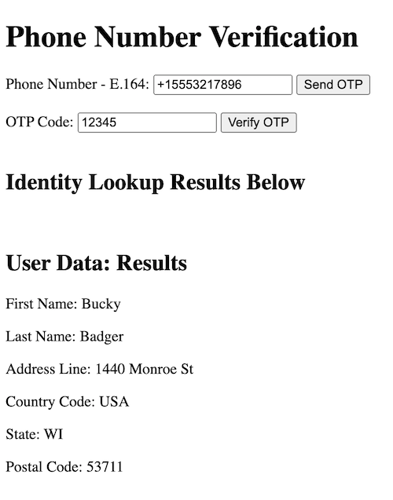

# Twilio Verify: Identity-Prefill-API Demo

Demo application showing Twilio Verify and Lookup Identity-Prefill APIs

In today's digital age, user experience is paramount. Every additional step or friction point can deter potential customers, reduce conversion rates, and degrade the overall experience. To combat this, Twilio introduces an innovative feature within its Lookup API: **Identity Pre-Fill** in Pilot. This powerful tool can revolutionize how businesses handle customer interactions, from onboarding to checkout, by pre-populating user data with verified information. Below, we discuss how this feature works, its potential benefits, and ways you can leverage it through a sample demo app.

This project demonstrates a phone number verification and prefilling user information using Twilio's Verify and Lookups APIs. Users can enter their phone number, receive an OTP, and verify their phone number. Upon successful verification, additional user details such as name and address will be fetched and displayed after a 90 seconds delay.

## Features

- Send OTP to entered phone number using Twilio Verify API.
- Verify OTP entered by the user.
- Fetch and display user information using Twilio Lookups API after successful OTP verification with a 90 seconds delay.

### What is Identity Pre-Fill?

**Identity Pre-Fill** is a new pilot preview capability in the Twilio Lookup API that provides the first name, last name, and address of end-users after verifying their phone number possession using Twilio Verify. This data helps pre-populate forms, making the user experience smoother and faster by reducing manual input efforts.



## Pre-requisites

Access is behind a flag during the pilot phase. 
[Request Access Here](https://docs.google.com/forms/d/e/1FAIpQLSfXowQ9dUGgDNc_onA0yj2_Mo3tXxFWK67SpDfOZjONothBYQ/viewform?usp=send_form).

### Technical Considerations

A few technical aspects to keep in mind:

- Queries to the Identity Pre-Fill API are only accepted within 10 minutes of successful verification through Twilio Verify.

- This product is only available in the United States during the pilot phase.

- Use of this product requires the use of the Twilio Verify product. Customers using custom code implementations for verification are not eligible for the pilot.

### Environment variables

This project requires some environment variables to be set. A file named `.env` is used to store the values for those environment variables. To keep your tokens and secrets secure, make sure to not commit the `.env` file in git. When setting up the project with `twilio serverless:init ...` the Twilio CLI will create a `.gitignore` file that excludes `.env` from the version history.

In your `.env` file, set the following values:

| Variable             | Description | Required |
| :------------------- | :---------- | :------- |
| `VERIFY_SERVICE_SID` | Verify SID  | True     |

### Function Parameters

`/send-otp` expects the following parameters:

| Parameter   | Description        | Required |
| :---------- | :----------------- | :------- |
| phoneNumber | E.164 Phone Number | True     |

`/verify-otp` expects the following parameters:

| Parameter   | Description        | Required |
| :---------- | :----------------- | :------- |
| phoneNumber | E.164 Phone Number | True     |
| code        | Verify Code        | True     |

`/fetch-user-data` expects the following parameters:

| Parameter        | Description         | Required |
| :--------------- | :------------------ | :------- |
| verificationSid  | Approved Verify SID | True     |

## Create a new project with the template

1. Install the [Twilio CLI](https://www.twilio.com/docs/twilio-cli/quickstart#install-twilio-cli)
2. Install the [serverless toolkit](https://www.twilio.com/docs/labs/serverless-toolkit/getting-started)

```shell
twilio plugins:install @twilio-labs/plugin-serverless
```

3. Initiate a new project

```
twilio serverless:init example --template=verify-prefill && cd example
```

4. Start the server with the [Twilio CLI](https://www.twilio.com/docs/twilio-cli/quickstart):

```
twilio serverless:start
```

5. Open the web page at <https://localhost:3000/index.html> and enter your phone number to test

ℹ️ Check the developer console and terminal for any errors, make sure you've set your environment variables.

## Deploying

Deploy your functions and assets with either of the following commands. Note: you must run these commands from inside your project folder. [More details in the docs.](https://www.twilio.com/docs/labs/serverless-toolkit)

With the [Twilio CLI](https://www.twilio.com/docs/twilio-cli/quickstart):

```
twilio serverless:deploy
```

## Test the Application

1. Access your Twilio Function URL that serves the `index.html` file.
2. Enter a phone number and click on "Send OTP."
3. Enter the received OTP and click on "Verify OTP."
4. Upon successful verification, wait for 90 seconds, and then user data should be displayed on the webpage.

### Conclusion

Identity Pre-Fill is a game-changer for businesses looking to enhance user experiences and streamline processes. By reducing the effort required to fill out forms and ensuring data accuracy while speeding up interactions, you can significantly improve customer satisfaction and conversion rates.

#### Learn More

For detailed documentation and more information on Twilio Lookup APIs, visit the [Twilio Lookup API documentation](https://www.twilio.com/docs/lookup/api).
