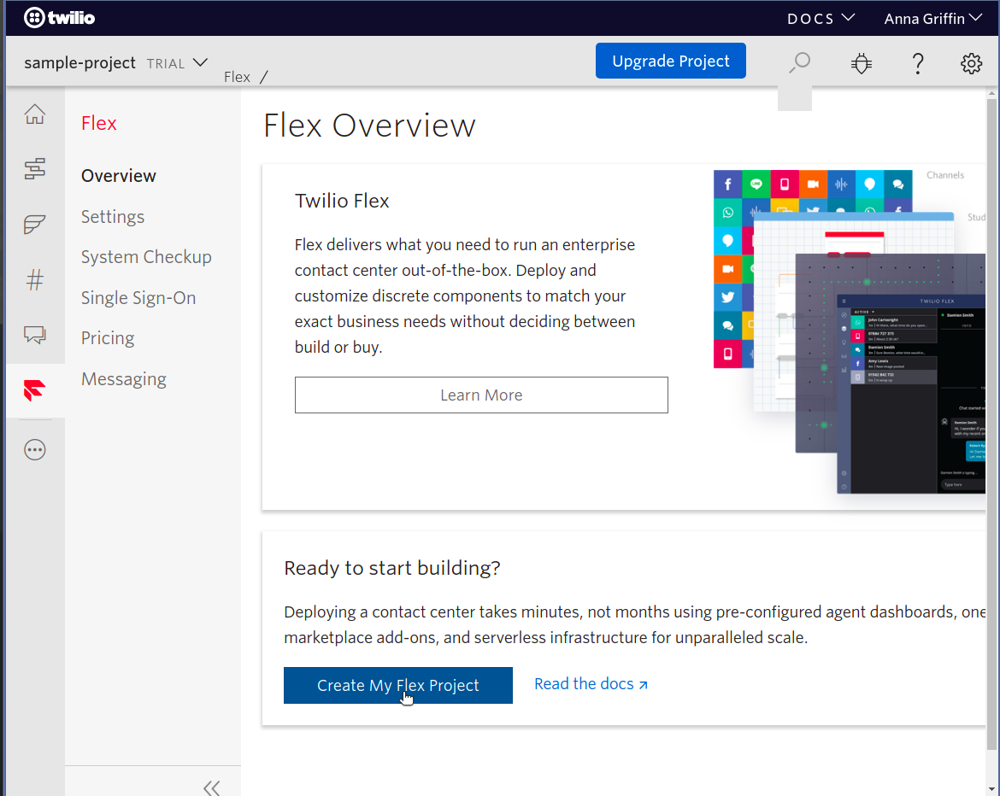
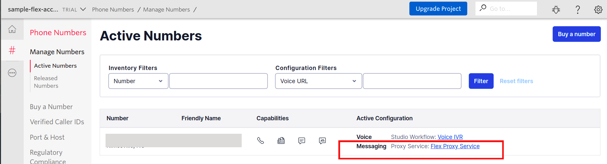
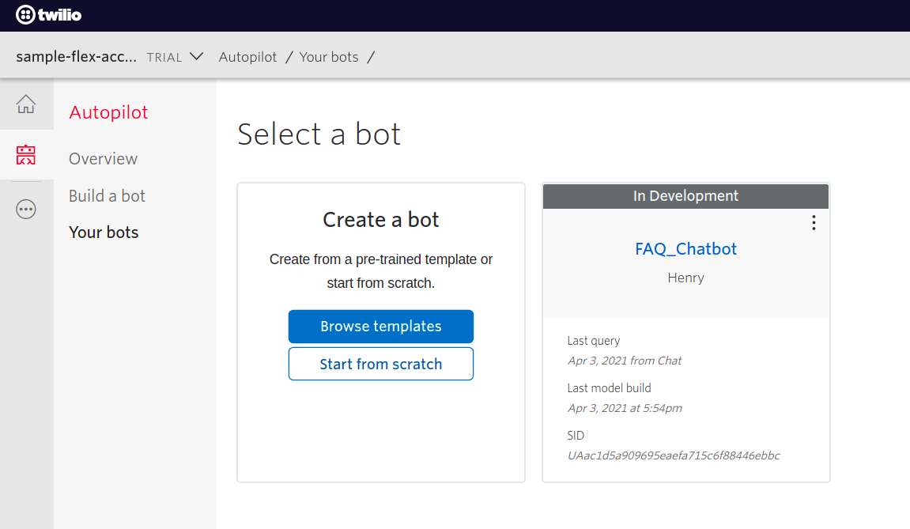
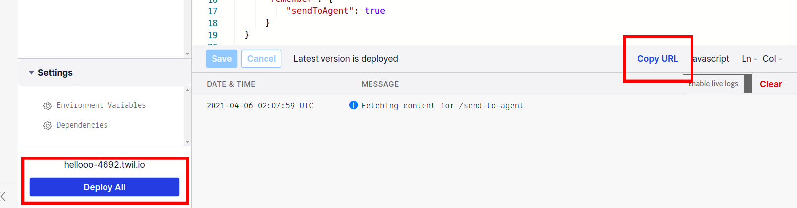
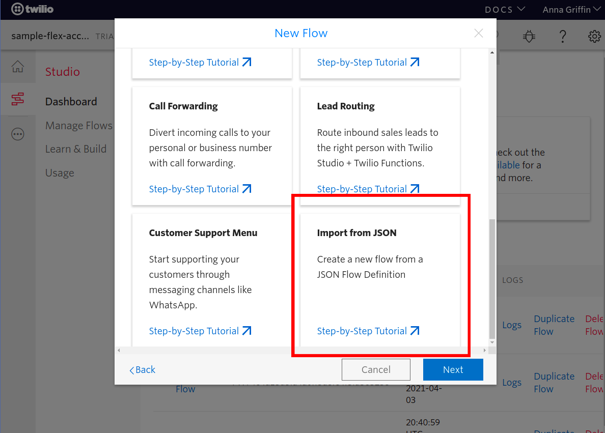
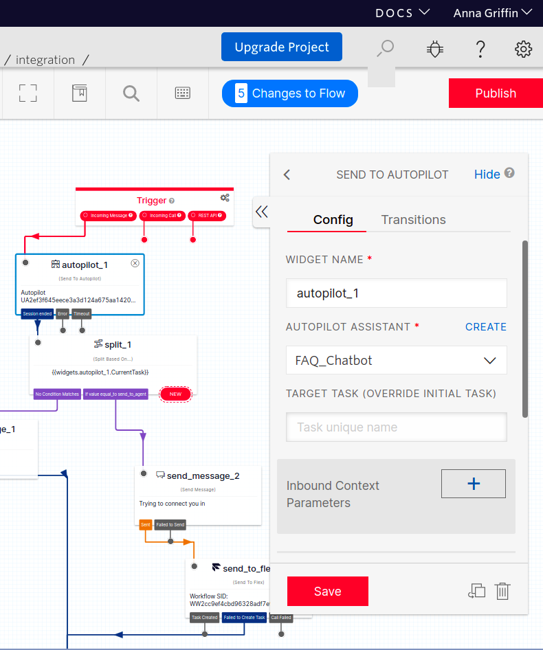
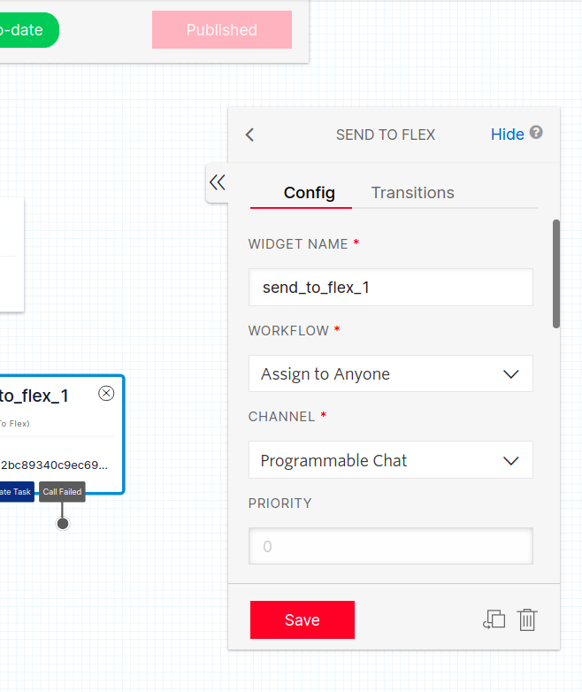

# Volunteer Communication Center

## Getting Started

info/description

### 1. Create an account

Create an Twilio account, you can sign up for a free trial account [here](https://www.twilio.com/try-twilio)

### 2. Set up Flex

Create a Flex Project by going to the Flex tab on the side menu and clicking 'Create My Start Project'



Confirm that you have a phone number, creating a Flex project should have created one for you. It should be listed in the [Phone Numbers](https://www.twilio.com/console/phone-numbers/incoming) tab in the console. Under the "Active Configuration" column in the table of numbers, Messaging should say **Flex Proxy Service**. 





### 3. Set up Autopilot

Import our Autopilot bot into your project. To do so, you must have [Twilio CLI](https://www.twilio.com/docs/twilio-cli/quickstart) and the [Autopilot plug-in](https://www.twilio.com/docs/autopilot/twilio-autopilot-cli) installed. 

Twilio CLI

```

npm install twilio-cli -g
```

Autopilot Plugin 

```
twilio plugins:install @dabblelab/plugin-autopilot
```

Login to your Twilio Account in the CLI 

```
twilio login
```

Use the CLI to upload the [`FAQ_Chatbot.json`](FAQ_Chatbot.json) file through the console.

```
twilio autopilot:create -s FAQ_Chatbot.json
```

You can check that it was successfully created by going to the [Autopilot](https://www.twilio.com/console/autopilot/list) tab in the console.



### 4. Create a function

Create a function in the [Functions](https://www.twilio.com/console/functions/overview) tab which will handle the handoff between Autopilot and Flex.

Create a new service and name it handoff. You should be brought to the editor, if not you can click on the service name you just created. Add a function and call it `send-to-agent`. Copy and paste the code in [`function/send-to-agent.js`](functions/send-to-agent.js) file in this directory. 

Press "Deploy All" at the bottom of the page and then "Copy URL" 




### 5. Configure Autopilot

Find the "send_to_agent" task in the FAQ_Chatbot [task list](https://www.twilio.com/console/autopilot/FAQ_Chatbot/tasks) and select the radio button that says "Actions URL" and paste the URL you just copied in the text field. Press save at the bottom of the page and then "Build Model"

### 6. Create Studio Flow

Go to the [Studio tab](https://www.twilio.com/console/studio/dashboard) and create a new flow called "Chatbot Interaction Flow" and select the option "Import from json" in the menu that pops up. 



Modify the Autopilot Widget by selecting the widget and setting the FAQ_Chatbot under the Autopilot Assistant. Press save.


Modify the Flex Widget. Set the Workflow to "Assign to Anyone" and the channel to "Programmable Chat". Press save.

<div style="{ display: flex; flex-direction: row;}">


</div>

Click Publish at the top right of the page to publish your flow.


### 7. Connect Phone Number

Go to the Flex tab and click Messaging from the side menu. Then edit the SMS channel and set the Studio Flow configuration to the flow you just made. 

## Try it out

Text the phone number you just set up. You should receive a message from the bot telling you what it can do! Make sure your phone number is [registered](https://www.twilio.com/console/phone-numbers/verified) in order to do so with trial accounts. 